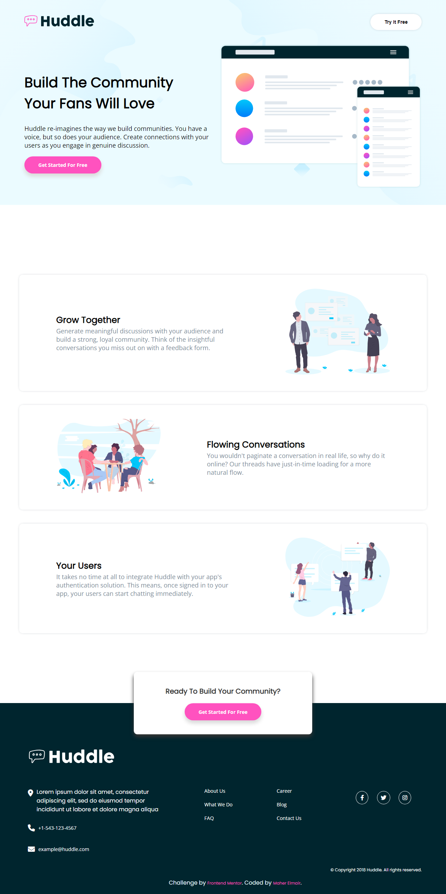

# 🌐 Huddle Landing Page with Alternating Feature Blocks - Frontend Mentor Challenge

A responsive and stylish landing page featuring alternating feature sections for a community platform.  
This project is my solution to the [Frontend Mentor Huddle landing page challenge](https://www.frontendmentor.io/challenges/huddle-landing-page-with-alternating-feature-blocks-ryvBBfF0) — built to sharpen layout and Sass skills.

---

## 📸 Screenshots

### 🖥️ Desktop View  


---

## 🛠️ Built With

- HTML5  
- CSS3 + Sass (partials, nesting, variables, mixins)  
- Responsive Design with CSS Grid & Flexbox  
- Google Fonts – [Open Sans & Poppins](https://fonts.google.com/)  
- Font Awesome Icons  

---

## 📂 Folder Structure

```
Huddle-landing-page-with-alternating-feature-blocks/
├── images/
│   ├── favicon-32x32.png
│   ├── logo.svg
│   ├── illustration-mockups.svg
│   ├── illustration-grow-together.svg
│   ├── illustration-flowing-conversation.svg
│   ├── illustration-your-users.svg
│   ├── logo\_footer.svg
│   ├── bg-hero-desktop.svg
│   └── bg-hero-mobile.svg
├── Sass/
│   ├── \_breakpoints.scss
│   ├── \_Custom-Scrollbars-&-Selection-color.scss
│   ├── \_containerScreen.scss
│   └── style.scss
├── Css/
│   ├── style.css
│   └── style.css.map
├── index.html
├── screencapture-Huddle-landing-page.png
└── README.md
```

---

## 📋 Features

- 🔁 Alternating feature blocks with image and text (Grow Together, Flowing Conversations, Your Users)  
- 🎨 Styled using Sass: variables, nesting, mixins, partials for organized CSS  
- 🚀 Hero section with a strong call-to-action button  
- 🧩 Responsive layout using flexbox and grid principles  
- 🗂️ Custom scrollbars and selection colors for enhanced UI details  
- 🌐 Social media icons and footer navigation built with Font Awesome  
- 🧠 Great practice for using modular CSS architecture and Sass workflows

---

## 🚀 Live Demo

🔗 [View Live Project](https://maher-elmair.github.io/Huddle-landing-page-with-alternating-feature-blocks/)

---

## 🧑‍💻 Author

**Maher Elmair**

📫 [maher.elmair.dev@gmail.com](mailto:maher.elmair.dev@gmail.com)  
🔗 [LinkedIn](https://www.linkedin.com/in/maher-elmair-831042237)  
❤️ Built with passion by [Maher Elmair](https://maher-elmair.github.io/My_Website)

---

## 🙏 Acknowledgments

- 🎓 Challenge by [Frontend Mentor](https://www.frontendmentor.io/)  
- 🖼️ Design assets and layout specifications provided by the original challenge mockup

---
